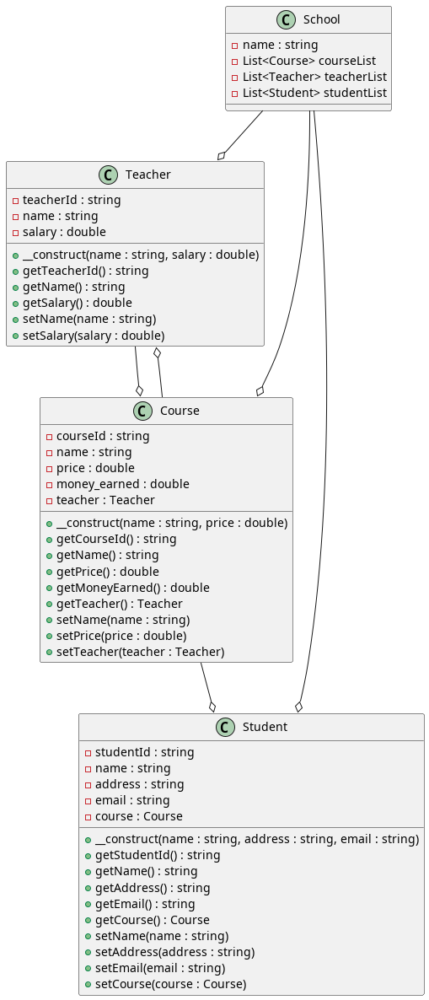
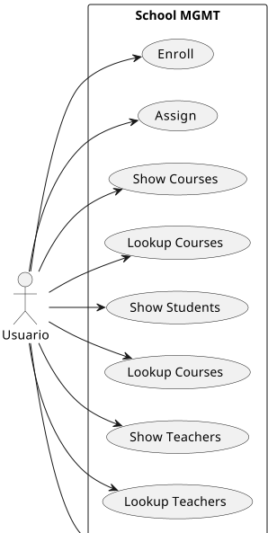

## IronSchool

### Introduction
This project is a text-based menu system that allows the user to create and manage
a school system. The system includes three main classes: Teacher, Student, 
and Course. Each class has its own unique attributes and methods, and the user 
can interact with them through a series of commands in the standard input.

### Classes
#### Teacher class
This class represents a teacher in the school system and has the following attributes:

- teacherId (string, auto-generated, private)
- name (string, private)
- salary (double, private)

The class has a parameterized constructor that takes in the name and salary of the teacher.
It also has public getter and setter functions for each attribute.

#### Course class
This class represents a course offered in the school system and has the following attributes:

- courseId (string, auto-generated, private)
- name (string, private)
- price (double, private)
- money_earned (double, private)
- teacher (Teacher, nullable, private)
- 
The class has a parameterized constructor that takes in the name and price of the course. It also has public getter 
and setter functions for each attribute.

#### Student class
This class represents a student in the school system and has the following attributes:

- studentId (string, auto-generated, private)
- name (string, private)
- address (string, private)
- email (string, private)
- course (Course, nullable, private)

The class has a parameterized constructor that takes in the name, address, and email of the student. 
It also has public getter and setter functions for each attribute.

### Application flow
The application starts by asking the user for a name for the school
Next, the user is asked for a number of how many teachers should be created
Next, the user is prompted to enter the details of each teacher (based on the number chosen above)
Next, the user is asked for the number of courses to be created (Do not specify the teacher yet, 
there is a command for it)
Next, the user is prompted to enter details of each course based on the number chosen above
Next, the user is asked for the number of students to be created (Do not specify the course yet, 
there is a command for it)
Next, the user is prompted to enter details of each student based on the number chosen above
Next, the user is now prompted to enter any command of the list below to execute a specified action in the system.

### Commands

ENROLL [STUDENT_ID] [COURSE_ID]: This command help enroll the student specified in the corresponding course. While also updating the money_earned of that course based on its price
ASSIGN [TEACHER_ID] [COURSE_ID]: This command  help assign the teacher specified to the corresponding course
SHOW COURSES: This command display a list of all courses
LOOKUP COURSE [COURSE_ID]: This command display the full details of the specified course
SHOW STUDENTS: This command display a list of all students
LOOKUP STUDENT [STUDENT_ID]: This command display the full details of the specified student
SHOW TEACHERS: This command display a list of all teachers
LOOKUP TEACHER [TEACHER_ID]: This command display the full details of the specified teacher
SHOW PROFIT: This command calculate (The total money earned from all courses)

